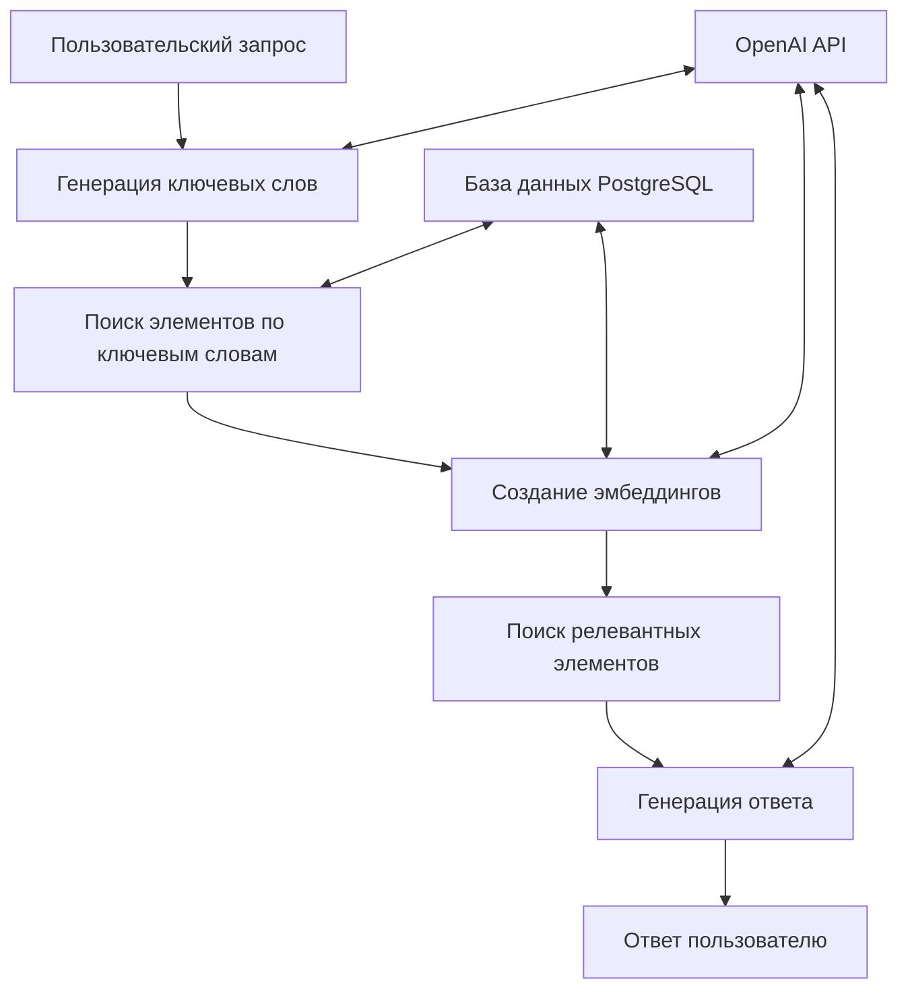

# MaymunAI

## Описание

MaymunAI - это персональный ассистент, который использует технологию RAG (Retrieval-Augmented Generation) для ответов на вопросы пользователя на основе базы знаний, хранящейся в PostgreSQL. Система сочетает семантический поиск с использованием эмбеддингов OpenAI и генерацию ответов на базе GPT-4 Turbo, обеспечивая релевантные и контекстуализированные ответы. Проект развивается к модульной архитектуре с переключаемыми ретриверами (native/FastGPT/RAGFlow) и режимами MCP.

## Ключевые особенности

- **Семантический поиск** с использованием эмбеддингов OpenAI (text-embedding-3-large)
- **Генерация ответов** с использованием GPT-4 Turbo на основе найденного контекста
- **Поиск по ключевым словам** и автоматическая генерация ключевых слов для запросов
- **Иерархическая структура данных** с поддержкой родительских и дочерних элементов
- **Кэширование эмбеддингов** для оптимизации производительности
- **Интерактивный режим отладки** с возможностью настройки параметров
- **Анализ базы данных** и миграция схемы
- **Гибкая настройка контекста** (родительский и дочерний уровни)
- **Переключаемые ретриверы**: native, FastGPT, RAGFlow (через config.yaml)
- **MCP-режим**: запуск MaymunAI как MCP-сервера (каркас)

## Архитектура

Система построена на следующих компонентах:

- **База данных**: PostgreSQL для хранения элементов (items) и их векторных представлений (эмбеддингов)
- **Эмбеддинги**: Использование OpenAI API для создания векторных представлений текста
- **Поиск**: Семантический поиск с использованием косинусного сходства между эмбеддингами запросов и документов
- **Генерация**: Использование GPT-4 Turbo для генерации естественных ответов на основе найденного контекста
- **Интерфейс**: Консольное приложение с интерактивным режимом взаимодействия



## Установка

### Требования к системе

- Python 3.8+
- PostgreSQL 12+
- OpenAI API ключ

### Установка зависимостей

1. Клонируйте репозиторий:
```bash
git clone https://github.com/yourusername/MaymunAI.git
cd MaymunAI
```

2. Установите зависимости Python:
```bash
pip install -r requirements.txt
```

3. Настройте переменные окружения. Создайте файл `.env` на основе `.env.example`:
```bash
cp .env.example .env
```

Отредактируйте `.env` файл, указав:
- OPENAI_API_KEY - ваш ключ API OpenAI
- DATABASE_URL - URL подключения к PostgreSQL

### Настройка базы данных

1. Создайте базу данных PostgreSQL
2. Запустите миграцию схемы:
```bash
python main.py --migrate
```

## Docker установка для кроссплатформенной разработки

Для обеспечения кроссплатформенной разработки и упрощения установки рекомендуется использовать Docker. Это позволяет запускать приложение в изолированной среде с предустановленными зависимостями, независимо от операционной системы (Windows, macOS, Linux).

### Преимущества Docker

- **Кроссплатформенность**: Одинаковая среда разработки на любой ОС
- **Изоляция зависимостей**: Нет конфликтов с локальными установками Python или PostgreSQL
- **Быстрый старт**: Все сервисы (приложение + база данных) запускаются одной командой
- **Персистентные данные**: База данных сохраняется в Docker volumes

### Быстрый старт

1. **Установите Docker и Docker Compose** на вашей системе.

2. **Клонируйте репозиторий и настройте переменные:**
   ```bash
   git clone https://github.com/yourusername/MaymunAI.git
   cd MaymunAI
   cp .env.example .env
   ```
   Отредактируйте `.env` файл, указав ваш OpenAI API ключ.

3. **Запустите сервисы:**
   ```bash
   docker-compose up --build
   ```

Приложение будет доступно для использования аналогично локальной установке.

### Управление контейнерами

- Запуск в фоне: `docker-compose up -d`
- Остановка: `docker-compose down`
- Просмотр логов: `docker-compose logs -f app`

Подробную информацию о Docker настройке, переменных окружения и решении проблем см. в [`DOCKER_README.md`](DOCKER_README.md).

## Использование

### Основной запуск

Запустите интерактивный режим:
```bash
python main.py
```

### Режимы запуска (config.yaml)

В корне проекта используется `config.yaml` для переключения режимов:

```yaml
mode:
  db_access: native_pg   # native_pg | mcp_pg
  retriever: RAG_NATIVE  # RAG_NATIVE | RAG_FASTGPT | RAG_RAGFLOW
  run_as: client_app     # client_app | mcp_server
```

Для режима MCP:

```bash
python main.py --run-as mcp_server
```

### Параметры запуска

- `-d`, `--debug` - Включить режим отладки
- `-dd`, `--debug_extended` - Расширенный режим отладки
- `-i`, `--info` - Просмотр информации о блоках
- `-n NAME`, `--name NAME` - Поиск блока по названию
- `-b ID`, `--block-id ID` - Просмотр информации по ID блока
- `-r MARKERS`, `--roots MARKERS` - Корневые маркеры для поиска
- `-v`, `--view-tree` - Показать дерево элементов
- `-s TEXT`, `--search TEXT` - Поиск по тексту в базе данных
- `-c N`, `--context N` - Размер контекста при поиске (по умолчанию: 2)
- `--clear-cache` - Очистить кэш эмбеддингов
- `--preload` - Предзагрузить эмбеддинги частых запросов
- `--migrate` - Обновить структуру базы данных
- `--rebuild-tables` - Перестроить таблицы эмбеддингов
- `--clear-invalid` - Очистить эмбеддинги с неправильной размерностью
- `--parent-context N` - Уровни родительского контекста (0 - отключено)
- `--child-context N` - Уровни дочернего контекста (0 - отключено)

### Интерактивный режим

После запуска программа входит в интерактивный режим, где:
1. Вводите ваш вопрос
2. Указываете ключевые слова через запятую (или `!` для автоматической генерации)
3. Получаете релевантный ответ на основе базы знаний

Для выхода введите `exit`, `quit` или `выход`.
Для перезапуска диалога введите `начало`.

## Структура проекта (обновляется)

```
MaymunAI/
├── main.py                 # Точка входа (совместимость CLI)
├── config.yaml             # Новый конфиг режимов/ретриверов
├── core/                   # settings/logging/prompts/mcp_server
├── db/                     # pg_native/pg_mcp_client/schema_introspect
├── rag/                    # embed/index/retriever/compose_context
├── modes/                  # runner_client/runner_mcp_server
├── cli/                    # ingest_docs/build_index/test_query
├── prompts/                # system/modes
├── docker/                 # fastgpt-compose.yml/ragflow-compose.yml
└── legacy файлы проекта
```

## Зависимости

Основные зависимости проекта:

- `openai>=1.12.0` - API OpenAI для эмбеддингов и генерации
- `psycopg2-binary>=2.9.9` - Драйвер PostgreSQL
- `numpy>=1.24.0` - Работа с векторами
- `pandas==2.2.3` - Анализ данных
- `pydantic==2.10.6` - Валидация данных
- `python-dotenv>=1.0.0` - Загрузка переменных окружения
- `tiktoken>=0.6.0` - Токенизация для OpenAI
- `httpx==0.28.1` - HTTP клиент
- `tqdm==4.67.1` - Прогресс-бары

Полный список зависимостей см. в файле `requirements.txt`.

## Текущее состояние

Проект находится на этапе стабилизации и активной разработки:

### Завершенные задачи:
- ✅ Изучение основных компонентов системы
- ✅ Анализ структуры базы данных и схемы хранения
- ✅ Реализация базового функционала RAG
- ✅ Исправление критических проблем с git репозиторием
- ✅ Удаление жестко закодированного API ключа (исправление уязвимости безопасности)
- ✅ Восстановление нормальной работы git команд

### Текущие задачи:
- Детальный анализ производительности системы
- Выявление узких мест и возможностей оптимизации
- Разработка плана улучшений

## План тестирования и валидации

- Регрессия CLI: запуск [main.py](main.py:1) с ключевыми флагами, проверка интерактивного режима.
- Валидация RAG: сверка качества ответов (precision@k/recall/NDCG) на наборе контрольных запросов.
- Проверка внешних ретриверов: smoke-тесты FastGPT/RAGFlow и корректность формата цитат.
- Миграция данных: тест на восстановление из дампа, проверка схемы через `schema_introspect`.

## План развития

### Фаза 1: Стабилизация и тестирование (текущая)
- Разработка модульных и интеграционных тестов
- Улучшение обработки ошибок API и базы данных
- Создание базовой документации
- Оптимизация существующего кода

### Фаза 2: Расширение функциональности
- Разработка веб-интерфейса для удобного взаимодействия
- Реализация API для интеграции с другими системами
- Улучшение стратегии кэширования эмбеддингов
- Добавление поддержки новых источников данных
- Многоязычная поддержка

### Фаза 3: Масштабирование и независимость
- Интеграция с локальными моделями (Llama, Mistral)
- Переход к микросервисной архитектуре
- Распределенное хранение и обработка данных
- Внедрение системы мониторинга и аналитики
- Персонализация ответов на основе истории запросов

## Разработка

### Запуск в режиме разработки

Для разработки с отладкой:
```bash
python main.py --debug
```

Для расширенной отладки:
```bash
python main.py --debug_extended
```

### Добавление данных в базу знаний

Проект поддерживает добавление новых элементов в базу знаний. Структура данных включает иерархические связи между элементами.

### Тестирование

Запуск тестов (планируется в будущих версиях):
```bash
pytest
```

## Безопасность MCP (минимум для MVP)

- Не хранить токены MCP/внешних сервисов в коде, только через `.env`.
- Принцип минимальных привилегий для БД и MCP tools.
- Логировать вызовы MCP tools без утечки секретов.

## Лицензия

MIT License - см. файл LICENSE для подробностей.

## Вклад в проект

Мы приветствуем вклад в развитие MaymunAI! Пожалуйста:

1. Создайте форк репозитория
2. Создайте ветку для вашей функциональности (`git checkout -b feature/AmazingFeature`)
3. Зафиксируйте изменения (`git commit -m 'Add some AmazingFeature'`)
4. Отправьте в ветку (`git push origin feature/AmazingFeature`)
5. Создайте Pull Request

## Контакты

Для вопросов и предложений:
- Создайте issue в репозитории
- Напишите на email: ваш-email@example.com

---

*MaymunAI - ваш интеллектуальный помощник на базе современных технологий ИИ*
