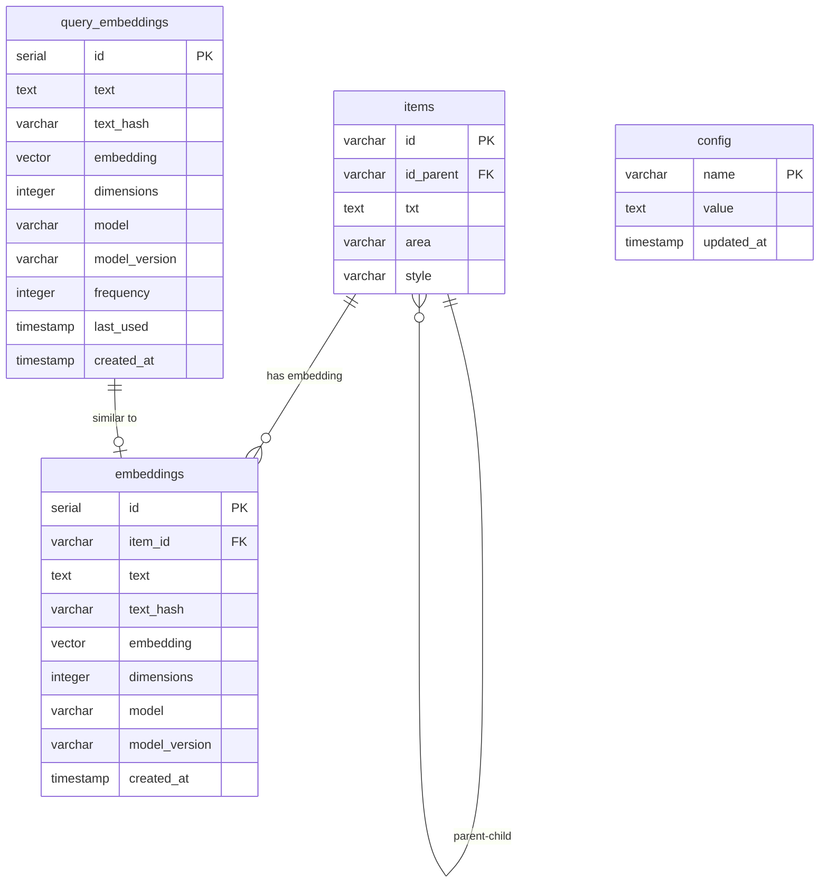

# Структура базы данных PostgreSQL в проекте MaymunAI/Нейрокод

## Общее описание

На основе анализа кода проекта, особенно файлов `db.py`, `config_db.py` и `db_analyzer.py`, можно выделить следующую структуру базы данных PostgreSQL, используемую в системе Нейрокод и MaymunAI.

## Основные таблицы

### 1. Таблица `items`

Центральная таблица системы, хранящая иерархическую структуру элементов (блоков) информации.

**Структура:**
```sql
CREATE TABLE items (
    id VARCHAR(255) PRIMARY KEY,  -- Уникальный идентификатор элемента (UUID)
    id_parent VARCHAR(255),       -- Ссылка на родительский элемент (для иерархии)
    txt TEXT,                     -- Текстовое содержимое элемента
    area VARCHAR(255),            -- Область/категория элемента
    style VARCHAR(255)            -- Стиль/тип элемента
);

-- Индекс для текстового поиска
CREATE INDEX idx_items_txt ON items USING gin(to_tsvector('russian', txt));
```

**Назначение:**
- Хранение иерархической структуры информации
- Поддержка вложенности элементов (родитель-потомок)
- Категоризация элементов по областям и типам

### 2. Таблица `embeddings`

Хранит векторные представления (эмбеддинги) текстовых элементов для семантического поиска.

**Структура:**
```sql
CREATE TABLE embeddings (
    id SERIAL PRIMARY KEY,
    item_id VARCHAR(255) NOT NULL,    -- Ссылка на элемент в таблице items
    text TEXT NOT NULL,               -- Текст, для которого создан эмбеддинг
    text_hash VARCHAR(64) NOT NULL,   -- Хеш текста для быстрого поиска
    embedding VECTOR(3072),           -- Векторное представление текста
    dimensions INTEGER NOT NULL,      -- Размерность вектора
    model VARCHAR(50) NOT NULL,       -- Модель, использованная для создания эмбеддинга
    model_version VARCHAR(20) NOT NULL, -- Версия модели
    created_at TIMESTAMP DEFAULT CURRENT_TIMESTAMP,
    UNIQUE(item_id, model, model_version)
);

-- Индексы для оптимизации поиска
CREATE INDEX idx_embeddings_item_id ON embeddings(item_id);
```

**Назначение:**
- Кэширование эмбеддингов для ускорения семантического поиска
- Связывание векторных представлений с элементами из таблицы items
- Отслеживание модели и версии, использованной для создания эмбеддинга

### 3. Таблица `query_embeddings`

Хранит эмбеддинги пользовательских запросов для оптимизации повторяющихся запросов.

**Структура:**
```sql
CREATE TABLE query_embeddings (
    id SERIAL PRIMARY KEY,
    text TEXT NOT NULL,                -- Текст запроса
    text_hash VARCHAR(64) NOT NULL,    -- Хеш текста запроса
    embedding VECTOR(3072),            -- Векторное представление запроса
    dimensions INTEGER NOT NULL,       -- Размерность вектора
    model VARCHAR(50) NOT NULL,        -- Модель, использованная для создания эмбеддинга
    model_version VARCHAR(20) NOT NULL, -- Версия модели
    frequency INTEGER DEFAULT 1,       -- Счетчик использования запроса
    last_used TIMESTAMP DEFAULT CURRENT_TIMESTAMP, -- Время последнего использования
    created_at TIMESTAMP DEFAULT CURRENT_TIMESTAMP,
    UNIQUE(text_hash, model, model_version)
);

-- Индексы для оптимизации поиска
CREATE INDEX idx_query_embeddings_text_hash ON query_embeddings(text_hash);
CREATE INDEX idx_query_embeddings_frequency ON query_embeddings(frequency DESC);
```

**Назначение:**
- Кэширование эмбеддингов часто используемых запросов
- Отслеживание частоты использования запросов
- Оптимизация производительности для повторяющихся запросов

### 4. Таблица `config`

Хранит конфигурационные параметры системы.

**Структура:**
```sql
CREATE TABLE config (
    name VARCHAR(255) PRIMARY KEY,     -- Имя параметра
    value TEXT,                        -- Значение параметра
    updated_at TIMESTAMP WITH TIME ZONE DEFAULT CURRENT_TIMESTAMP -- Время последнего обновления
);
```

**Назначение:**
- Хранение настраиваемых параметров системы
- Централизованное управление конфигурацией
- Отслеживание изменений параметров

## Связи между таблицами



## Особенности и оптимизации

1. **Иерархическая структура данных**:
   - Таблица `items` имеет самоссылку через поле `id_parent`, что позволяет создавать древовидные структуры данных
   - Используются рекурсивные запросы для обхода дерева элементов

2. **Векторные операции**:
   - Использование типа `VECTOR` для хранения эмбеддингов
   - Вычисление косинусного сходства для поиска семантически близких элементов

3. **Кэширование**:
   - Кэширование эмбеддингов элементов и запросов для снижения нагрузки на API OpenAI
   - Отслеживание частоты использования запросов для оптимизации кэша

4. **Текстовый поиск**:
   - Использование полнотекстового поиска PostgreSQL через индекс GIN
   - Поддержка русского языка в текстовом поиске

5. **Версионирование моделей**:
   - Отслеживание версий моделей для эмбеддингов
   - Возможность миграции данных при изменении моделей

## Рекомендации по оптимизации

1. **Индексы**:
   - Добавить индекс по полю `id_parent` в таблице `items` для ускорения иерархических запросов
   - Рассмотреть возможность использования специализированных индексов для векторных данных (например, HNSW)

2. **Партиционирование**:
   - При росте объема данных рассмотреть возможность партиционирования таблицы `items` по полю `area`
   - Партиционирование таблицы `embeddings` по модели или времени создания

3. **Архивирование**:
   - Внедрить механизм архивирования редко используемых запросов и их эмбеддингов
   - Создать политику хранения для управления жизненным циклом данных

4. **Мониторинг**:
   - Добавить таблицу для хранения метрик производительности запросов
   - Внедрить механизм отслеживания использования ресурсов базы данных