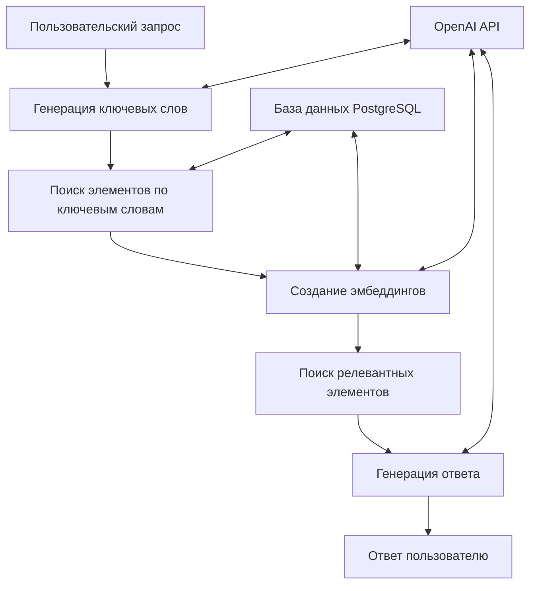

# План ознакомления и улучшения проекта MaymunAI

## 1. Анализ текущего состояния проекта

### 1.1. Архитектура системы

### 1.2. Основные компоненты
- **main.py**: Точка входа в приложение, обработка аргументов командной строки
- **config.py**: Конфигурация системы, настройки моделей и параметров
- **db.py**: Работа с базой данных, запросы к PostgreSQL
- **embeddings.py**: Создание и управление эмбеддингами
- **retrieval.py**: Поиск релевантных документов
- **rag.py**: Генерация ответов на основе найденных документов
- **keywords.py**: Генерация ключевых слов для запросов
- **process_query.py**: Обработка пользовательских запросов
- **debug_utils.py**: Инструменты для отладки и анализа

### 1.3. Выявленные проблемы и ограничения
1. Отсутствие тестов для проверки функциональности
2. Ограниченный пользовательский интерфейс (только консоль)
3. Зависимость от внешних API (OpenAI)
4. Отсутствие мониторинга и логирования для продакшн-среды
5. Неясная стратегия обработки ошибок API и базы данных
6. Отсутствие документации по настройке и развертыванию

## 2. Предлагаемые улучшения

### 2.1. Краткосрочные улучшения
1. **Добавление тестов**:
   - Модульные тесты для ключевых компонентов
   - Интеграционные тесты для проверки взаимодействия
   - Тесты производительности

2. **Улучшение обработки ошибок**:
   - Более детальная обработка ошибок API OpenAI
   - Механизм повторных попыток при временных сбоях
   - Корректное завершение работы при критических ошибках

3. **Улучшение документации**:
   - Руководство по установке и настройке
   - Документация по API и основным компонентам
   - Примеры использования и сценарии применения

### 2.2. Среднесрочные улучшения
1. **Улучшение пользовательского интерфейса**:
   - Веб-интерфейс для более удобного взаимодействия
   - API для интеграции с другими системами
   - Визуализация результатов поиска и связей между документами

2. **Оптимизация производительности**:
   - Улучшение стратегии кэширования эмбеддингов
   - Оптимизация запросов к базе данных
   - Параллельная обработка запросов

3. **Расширение функциональности**:
   - Поддержка различных источников данных (файлы, веб-страницы)
   - Многоязычная поддержка
   - Персонализация ответов на основе истории запросов

### 2.3. Долгосрочные улучшения
1. **Снижение зависимости от внешних API**:
   - Интеграция с локальными моделями (Llama, Mistral)
   - Возможность переключения между локальными и облачными моделями
   - Гибридный подход с использованием разных моделей для разных задач

2. **Масштабирование системы**:
   - Микросервисная архитектура для отдельных компонентов
   - Горизонтальное масштабирование для обработки большого количества запросов
   - Распределенное хранение и обработка данных

3. **Расширенная аналитика**:
   - Мониторинг качества ответов
   - Анализ пользовательских запросов для улучшения системы
   - Обратная связь от пользователей для оценки релевантности

## 3. План реализации

### 3.1. Фаза 1: Стабилизация и тестирование
- Разработка тестов для ключевых компонентов
- Улучшение обработки ошибок
- Создание базовой документации
- Оптимизация существующего кода

### 3.2. Фаза 2: Расширение функциональности
- Разработка веб-интерфейса
- Улучшение стратегии кэширования
- Добавление поддержки новых источников данных
- Реализация многоязычной поддержки

### 3.3. Фаза 3: Масштабирование и независимость
- Интеграция с локальными моделями
- Переход к микросервисной архитектуре
- Реализация распределенного хранения данных
- Внедрение системы мониторинга и аналитики