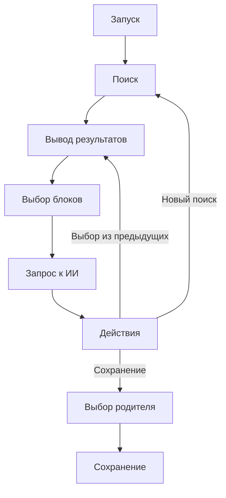

# План реализации standalone search mode

## Основные компоненты
1. **Поисковой модуль**
   - Использование функций из db.py
   - Поддержка текстового и векторного поиска
   - Хранение истории поиска в сессии
   - Доступ к результатам предыдущих поисков

2. **Интерфейс пользователя**
   - Консольное меню
   - Вывод результатов поиска (текущих и предыдущих)
   - Выбор блоков для контекста из любых доступных результатов
   - Управление диалогом

3. **Интеграция с ИИ**
   - Использование openai_api_models.py
   - Формирование промптов
   - Обработка ответов

4. **Сохранение результатов**
   - Выбор родительского блока (по умолчанию - первый выбранный)
   - Создание новой записи в items
   - Связь родитель-потомок

## Workflow

## Особенности реализации
- История поиска сохраняется в течение сессии
- Возможность комбинировать блоки из разных поисковых запросов
- Гибкий выбор родительского блока при сохранении