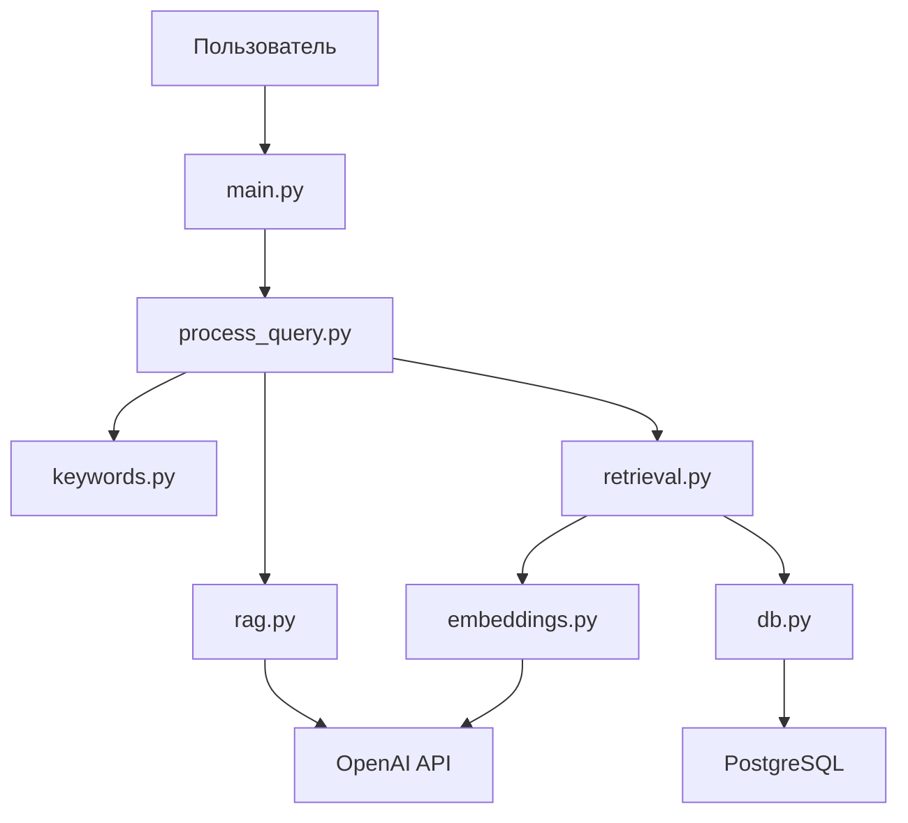

# План оптимизации Memory Bank для проекта MaymunAI

## Анализ текущего состояния

После ознакомления с README.md и инструкциями по управлению Memory Bank, а также проверки существующих файлов и учета их истории (предыдущие версии от 2025-03-30), выявлены следующие несоответствия:

### Существующие файлы и их статус:

1. **productContext.md**: Хорошо соответствует инструкциям, на русском языке, структура правильная. Последняя редакция: 2026-01-12 16:58:30.
   - Требует внимания: Возможное обновление с последними изменениями из README.md.

2. **activeContext.md**: Требует значительной оптимизации.
   - Заголовок и описание на английском языке (должно быть на русском).
   - Разделы на английском: "Current Focus", "Recent Changes", "Open Questions/Issues".
   - Отсутствует раздел "Правила редактирования".
   - Отсутствует раздел "Уточненная информация о среде выполнения".
   - Формат временных меток частично соответствует, но порядок записей требует проверки.

3. **systemPatterns.md**: Требует оптимизации.
   - Заголовок и описание на английском (должно быть на русском).
   - Разделы на английском: "Coding Patterns", "Architectural Patterns", "Testing Patterns".
   - Отсутствует раздел "Правила редактирования".
   - Содержимое частично соответствует, но требует реструктуризации.

4. **decisionLog.md**: Требует реструктуризации.
   - Структура не соответствует инструкциям: отсутствуют заголовки "## Решение: [Название]", подразделы "### Обоснование" и "### Детали реализации".
   - Есть записи без структуры.
   - Язык частично русский, но формат требует унификации.

5. **progress.md**: Требует оптимизации.
   - Заголовок и разделы на английском.
   - Отсутствует раздел "Правила редактирования".
   - Разделы: "Completed Tasks", "Current Tasks", "Next Steps" - требуют перевода на русский.
   - Отсутствует раздел "Последние обновления".
   - Порядок разделов требует проверки согласно инструкциям.

6. **system_full_info.md**: Файл существует, но не предусмотрен инструкциями. Содержит информацию о системе.
   - Рекомендуется интегрировать в activeContext.md как раздел "Уточненная информация о среде выполнения".

### Общие проблемы:
- Смешанный язык: Некоторые файлы на английском или с английскими элементами.
- Отсутствие разделов "Правила редактирования" в большинстве файлов.
- Несоответствие форматов временных меток (некоторые используют [ГГГГ-ММ-ДД ЧЧ:ММ:СС], другие другие форматы).
- Порядок записей не всегда обратный хронологический.

### История версий файлов Memory Bank:
- **Инициализация (2025-03-30)**: Файлы созданы с базовой структурой, частично на английском, без полных правил редактирования.
- **Оптимизация (коммит 1c2ee77, 2026-01-12)**: Все файлы переведены на русский, добавлены разделы "Правила редактирования", структуры унифицированы согласно инструкциям.
- **Merge conflict (коммит cfda7bb)**: После слияния веток файлы вернулись к английской версии из-за конфликтов.
- **Текущая ситуация**: Файлы требуют восстановления оптимизированной версии от 1c2ee77.

## Детальный план действий

### 1. Обновление productContext.md
- **Действия**:
  - Проверить актуальность содержания с README.md.
  - Добавить сноску с текущей временной меткой: 2026-01-12 18:32:00 - Обновление в рамках оптимизации Memory Bank.
- **Статус**: Минимальные изменения.

### 2. Реструктуризация activeContext.md
- **Действия**:
  - Перевести заголовок и описание на русский.
  - Добавить раздел "Правила редактирования" в соответствии с инструкциями.
  - Переименовать и перевести разделы:
    - "Current Focus" → "Текущий фокус"
    - "Recent Changes" → "Недавние изменения"
    - "Open Questions/Issues" → "Открытые вопросы/проблемы"
  - Добавить раздел "Уточненная информация о среде выполнения" и интегрировать данные из system_full_info.md.
  - Упорядочить записи в обратном хронологическом порядке.
  - Обновить временные метки на формат ГГГГ-ММ-ДД ЧЧ:ММ:СС.
  - Добавить сноску с текущей меткой.

### 3. Реструктуризация systemPatterns.md
- **Действия**:
  - Перевести заголовок и описание на русский.
  - Добавить раздел "Правила редактирования".
  - Перевести разделы:
    - "Coding Patterns" → "Паттерны кодирования"
    - "Architectural Patterns" → "Архитектурные паттерны"
    - "Testing Patterns" → "Паттерны тестирования"
  - Упорядочить записи.
  - Добавить сноску с текущей меткой.

### 4. Реструктуризация decisionLog.md
- **Действия**:
  - Перестроить структуру: убрать старые записи и организовать в формат "## Решение: [Название]" с подразделами "### Обоснование" и "### Детали реализации".
  - Добавить раздел "Правила редактирования".
  - Упорядочить в обратном хронологическом порядке.
  - Обновить временные метки.
  - Добавить сноску.

### 5. Реструктуризация progress.md
- **Действия**:
  - Перевести на русский.
  - Добавить раздел "Правила редактирования".
  - Перевести разделы:
    - "Completed Tasks" → "Выполненные задачи"
    - "Current Tasks" → "Текущие задачи"
    - "Next Steps" → "Следующие шаги"
  - Добавить раздел "Последние обновления".
  - Упорядочить согласно инструкциям.
  - Добавить сноску.

### 6. Интеграция system_full_info.md
- **Действия**:
  - Интегрировать содержимое в activeContext.md.
  - Удалить файл system_full_info.md после интеграции.

### 7. Общие действия
- **Временные метки**: Использовать текущую временную метку 2026-01-12 18:32:00 для всех обновлений "Последняя редакция".
- **Порядок выполнения**: Начать с productContext.md, затем activeContext.md, systemPatterns.md, decisionLog.md, progress.md.
- **Валидация**: После каждого обновления проверить соответствие формату.

## Mermaid диаграммы для архитектуры

Если требуется, можно добавить диаграмму архитектуры в productContext.md:

## Следующие шаги

После утверждения плана, перейти в режим Code для реализации изменений. Ожидаемое время: 1-2 часа на реализацию всех обновлений.